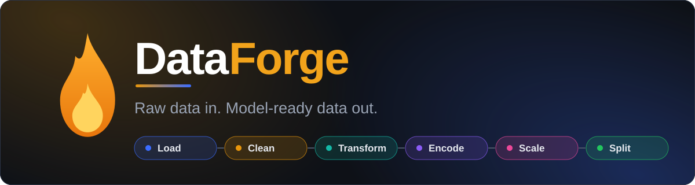
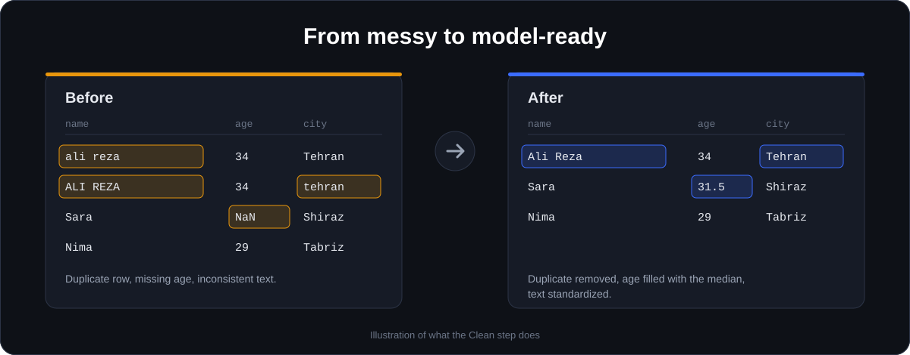

<div align="center">



<br>

<p>
Load a dataset, see what is wrong with it, fix it step by step, and export something your model can use.<br>
Automated data preparation for machine learning, with no pandas code required.
</p>

<a href="https://dataforge-prep.streamlit.app/">
  
</a>

<br><br>

[](https://github.com/MahdiKordian/DataForge)
[](LICENSE)
[](https://www.python.org)
[](https://streamlit.io)
[](https://github.com/MahdiKordian/DataForge/commits/main)
[](https://github.com/MahdiKordian/DataForge/stargazers)

[Features](#features) · [Quick start](#quick-start) · [Usage guide](#usage-guide) · [FAQ](#faq) · [Contributing](#contributing)

</div>

---

## Table of contents

- [About](#about)
- [Features](#features)
- [Quick start](#quick-start)
- [Usage guide](#usage-guide)
- [Supported inputs and outputs](#supported-inputs-and-outputs)
- [Sample datasets](#sample-datasets)
- [How it works](#how-it-works)
- [Project structure](#project-structure)
- [Tech stack](#tech-stack)
- [FAQ](#faq)
- [Roadmap](#roadmap)
- [Contributing](#contributing)
- [License](#license)
- [Acknowledgements](#acknowledgements)
- [Author](#author)

## About

Most of a machine learning project is not modeling. It is filling gaps, removing duplicates, taming outliers, encoding categories, scaling columns and splitting without leaking data, repeated in notebook after notebook.

DataForge turns that routine into one guided web app. It inspects your dataset, flags what is wrong, applies the fixes you choose, records every step in a log, and hands you a clean dataset and a report at the end. It is built for students, analysts and ML engineers who want reliable preprocessing without rewriting the same pandas code every time.

<p align="center">
  
</p>

## Features

- **Flexible loading.** Upload a file, paste from a spreadsheet, load from a URL, or type a small table. Separators, encodings and Excel sheets are detected automatically or set by hand.
- **Health dashboard.** An ML readiness score and a list of detected issues ranked by severity, so you know what to fix first.
- **Guided preparation.** Five steps (Clean, Transform, Encode, Scale, Split) with sensible defaults and full control over every option.
- **Deep analysis.** Nine views covering distributions, missing values, correlations, outliers, categoricals, the target, PCA and before vs after.
- **Undo and reset.** Every step is snapshotted, so you can go back or start over without reloading.
- **Full audit trail.** Each change is logged and can be downloaded, so your preparation is documented and repeatable.
- **Ready-to-share output.** Export the prepared data and a standalone HTML or Markdown report.
- **Private by design.** Your data lives only in the current session and is never stored.

### The Prepare pipeline

| Step | What you can do |
|------|-----------------|
| **Clean** | Trim whitespace, change text case, convert numbers stored as text, remove duplicate rows, drop constant and mostly-empty columns, remove rows with a missing target, fill missing values with the median, mean, most common value, zero or "Unknown", or drop the rows |
| **Transform** | Clip outliers at the 1st and 99th percentile or at IQR bounds, remove outlier rows, reduce skew with a log or square-root transform, drop highly correlated or unwanted columns |
| **Encode** | One-hot or ordinal encoding for columns with few categories, frequency or ordinal encoding (or dropping) for high-cardinality columns, date columns split into year, month, day and weekday, text targets turned into numeric classes |
| **Scale** | Standard (z-score), Min-max (0 to 1) or Robust (median and IQR) scaling on the columns you choose |
| **Split** | Train, validation and test sets with your own ratios and seed, optional stratification, and oversampling or undersampling of the training set for imbalanced classes |

### The Analysis views

| View | Shows |
|------|-------|
| Overview, Distributions, Missing | Dataset summary, per-column histograms and statistics, missing-value patterns |
| Correlations | Pearson, Spearman or Kendall, Cramér's V and the correlation ratio for categorical data, VIF for multicollinearity, with a threshold to flag strong pairs |
| Outliers | IQR, Z-score or Modified Z-score (MAD) detection |
| Categorical | Unique counts, top values and rare categories per column, frequency charts, and a Cramér's V heatmap between categorical columns |
| Target | How strongly each column relates to your target |
| PCA | Variance explained, a PC1 vs PC2 scatter coloured by the target, and the loadings of each column |
| Before vs after | Any earlier snapshot of the pipeline compared with the current data |

## Quick start

### Use it online

Click the **Open the Live Demo** button at the top. Nothing to install, and you can start from a built-in sample dataset.

> The demo runs on Streamlit Community Cloud and goes to sleep when idle. If you see a sleeping notice, click the wake-up button and wait a few seconds.

### Run it locally

You need **Python 3.10 or newer**.

```bash
# 1. Get the code
git clone https://github.com/MahdiKordian/DataForge.git
cd DataForge

# 2. Create an isolated environment (recommended)
python -m venv .venv
source .venv/bin/activate          # Windows: .venv\Scripts\activate

# 3. Install the dependencies
pip install -r requirements.txt

# 4. Launch the app
streamlit run app.py
```

Streamlit prints a local address, usually <http://localhost:8501>.

### Deploy your own copy

1. Fork this repository.
2. On [Streamlit Community Cloud](https://streamlit.io/cloud), choose **New app** and select your fork.
3. Set the main file path to `app.py` and deploy.

## Usage guide

1. **Load.** On the home page, upload a file or pick a sample. Use the Dataset page for pasted text, a URL, a specific Excel sheet, or to choose a **target column**.
2. **Inspect.** Open the Dashboard to read the readiness score and the issue list. Each issue points to the step that fixes it.
3. **Prepare.** Run Clean, Transform, Encode, Scale and Split in that order. Do the split last so no information leaks between sets.
4. **Explore.** Use Analysis at any point, and compare *Before vs after* to see what each step changed.
5. **Export.** Download the prepared data and the step log, then generate a report.

**Tips**

- Set a target column on the Dashboard to unlock stratified splitting and class balancing, which apply to classification targets.
- The readiness score rises as you fix issues. It checks for missing values, duplicates, constant columns, outliers (under 1% of values), non-numeric columns and a finished split.
- Loading a new dataset replaces the current one and clears its log.

## Supported inputs and outputs

| | Formats and options |
|---|---------------------|
| **Input files** | CSV, TSV, TXT, Excel (`.xlsx`, `.xls`), JSON, Parquet |
| **Other inputs** | Pasted text, URL, manually typed table, built-in samples |
| **Parsing** | Auto-detected or manual separator (comma, semicolon, tab, pipe), encoding fallback (UTF-8, UTF-8 with BOM, CP1256, Latin-1) |
| **Prepared data** | CSV, Excel, Parquet, JSON, with an optional row index. CSV can be written as UTF-8 with BOM so Excel shows non-Latin text such as Persian correctly |
| **Step log** | CSV, JSON, plain text |
| **Report** | HTML (light, dark or automatic theme) and Markdown, with the sections you choose: Summary, Findings, Column profile, Statistics, Relationships, Pipeline log, Before vs after, Recommendations |

## Sample datasets

Three real datasets ship in `sample_data/` and are offered on the home page, each with the usual problems so every step has something to do.

| Dataset | Task | Target | Challenges |
|---------|------|--------|------------|
| Ames Housing | Regression | `SalePrice` | Many columns, missing values, skewed prices |
| Telco Customer Churn | Classification | `Churn` | Class imbalance, numbers stored as text, an ID column |
| Palmer Penguins | Classification | `species` | Three classes, missing values, mixed types |

The Dataset page also offers three small generated practice sets: customer churn, house prices and student scores.

## How it works

DataForge is a multi-page Streamlit app. A small shared core keeps one working copy of your data in the session, together with a snapshot after every step and a log of what changed.

- `core.py` holds the shared state, file readers and helpers. Parsing is cached, and encodings are tried in order until one decodes cleanly.
- Each page in `pages/` handles one stage and reads from and writes to the same session state, so you can move freely between pages.
- Every Prepare step runs on the current data, logs row and column changes, and stores a snapshot. Undo restores the previous snapshot, and Reset returns to the data as loaded.
- Reports and exports are generated from the same log and snapshots, so they always match what you actually did.

## Project structure

```
DataForge/
├── app.py              Entry point: page config, navigation, sidebar
├── core.py             Shared state, file readers, sample loader, helpers
├── pages/
│   ├── landing.py      Home: upload or choose a sample
│   ├── dataset.py      All loading options and target selection
│   ├── dashboard.py    Overview, readiness score, detected issues
│   ├── prepare.py      Clean, Transform, Encode, Scale, Split
│   ├── analysis.py     The nine analysis views
│   ├── export.py       Download data and the step log
│   ├── report.py       HTML and Markdown report builder
│   └── about.py        About the project
├── sample_data/        Ames Housing, Telco Customer Churn, Palmer Penguins
├── docs/               README images
├── requirements.txt    Python dependencies
├── README.md           This file
├── LICENSE             Apache License 2.0
├── NOTICE              Third-party attributions
└── .gitignore
```

## Tech stack

| Library | Used for |
|---------|----------|
| [Streamlit](https://streamlit.io) | Web interface and multi-page navigation |
| [pandas](https://pandas.pydata.org) | Data loading and transformation |
| [NumPy](https://numpy.org) | Numerical work, splitting and sampling |
| [SciPy](https://scipy.org) | Statistics behind correlations and tests |
| [Altair](https://altair-viz.github.io) | Interactive charts |
| [openpyxl](https://openpyxl.readthedocs.io) | Reading and writing Excel files |
| [PyArrow](https://arrow.apache.org) | Reading and writing Parquet files |

## FAQ

<details>
<summary><b>The demo shows a sleeping notice.</b></summary>
<br>
Free Streamlit apps sleep after a period of inactivity. Click the wake-up button and it starts again within a few seconds.
</details>

<details>
<summary><b>My CSV shows broken characters in Excel.</b></summary>
<br>
On the Export page, keep the Excel-friendly option (UTF-8 with BOM) turned on. It makes Excel read non-Latin text such as Persian correctly.
</details>

<details>
<summary><b>Why can't I stratify or balance my split?</b></summary>
<br>
Both need a classification target. Choose a target column on the Dashboard first, and make sure it has a limited number of classes.
</details>

<details>
<summary><b>Excel export says my data is too large.</b></summary>
<br>
Excel holds at most 1,048,575 rows per sheet. Export to CSV or Parquet instead.
</details>

<details>
<summary><b>The split reports an empty train or test set.</b></summary>
<br>
Use smaller test and validation percentages, or load a dataset with more rows.
</details>

<details>
<summary><b>Is my data uploaded or stored anywhere?</b></summary>
<br>
No. Data stays in your current session and is cleared when you remove the dataset or close the session.
</details>

<details>
<summary><b>How large a file can I upload?</b></summary>
<br>
Streamlit's default upload limit is 200 MB. For larger files, run the app locally and raise <code>server.maxUploadSize</code> in <code>.streamlit/config.toml</code>.
</details>

## Roadmap

Ideas for future versions. Open an issue if one of these matters to you.

- [ ] Save a preparation as a reusable recipe and apply it to new data
- [ ] Export the pipeline as a Python script or scikit-learn pipeline
- [ ] More encoders, such as target encoding
- [ ] Automated tests and continuous integration
- [ ] Docker image for one-command deployment

## Contributing

Contributions are welcome, from bug reports to new features.

1. Fork the repository and create a branch: `git checkout -b feat/your-idea`
2. Make your change and run the app locally to test it.
3. Commit with a clear message. This project follows the [Conventional Commits](https://www.conventionalcommits.org) style, for example `feat(prepare): add target encoding`.
4. Push your branch and open a pull request describing what changed and why.

Found a bug or have a suggestion? [Open an issue](https://github.com/MahdiKordian/DataForge/issues).

## License

Released under the [Apache License 2.0](LICENSE). Third-party attributions are listed in [NOTICE](NOTICE).

## Acknowledgements

- **Ames Housing** by Dean De Cock.
- **Palmer Penguins** by Dr. Kristen Gorman and the Palmer Station LTER, packaged by Allison Horst and Alison Hill.
- **Telco Customer Churn**, an IBM sample dataset.
- The open-source libraries listed in the tech stack above.

Please check each dataset's original terms before redistributing it.

## Author

**Mahdi Kordian**, AI Engineer working on machine learning, deep learning, generative AI and LLMs.

<p align="center">
  <a href="https://github.com/MahdiKordian"></a>
  <a href="https://www.linkedin.com/in/mahdikordian/"></a>
  <a href="https://t.me/MahdiKordian/"></a>
  <a href="https://x.com/MahdiKordian/"></a>
</p>

<div align="center">

If DataForge saves you time, consider giving it a star ⭐

</div>